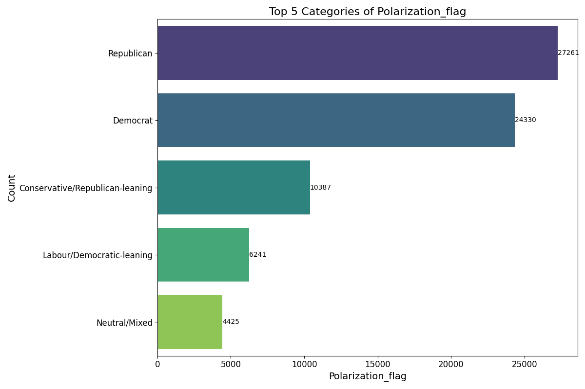
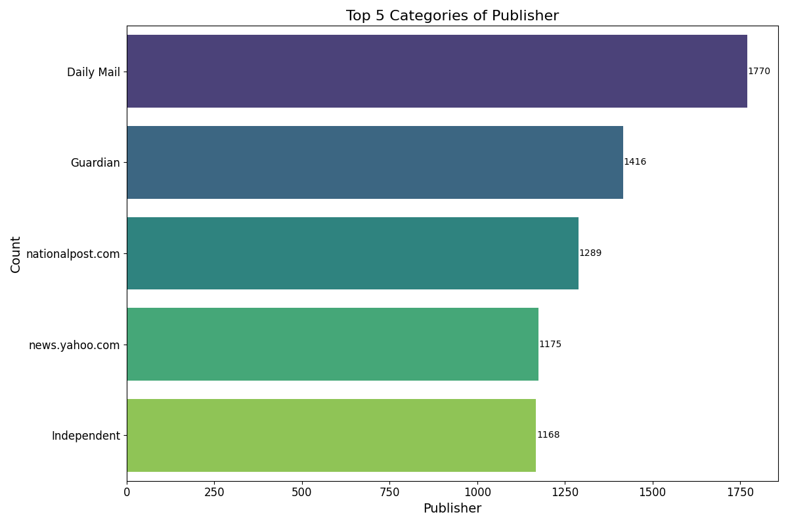
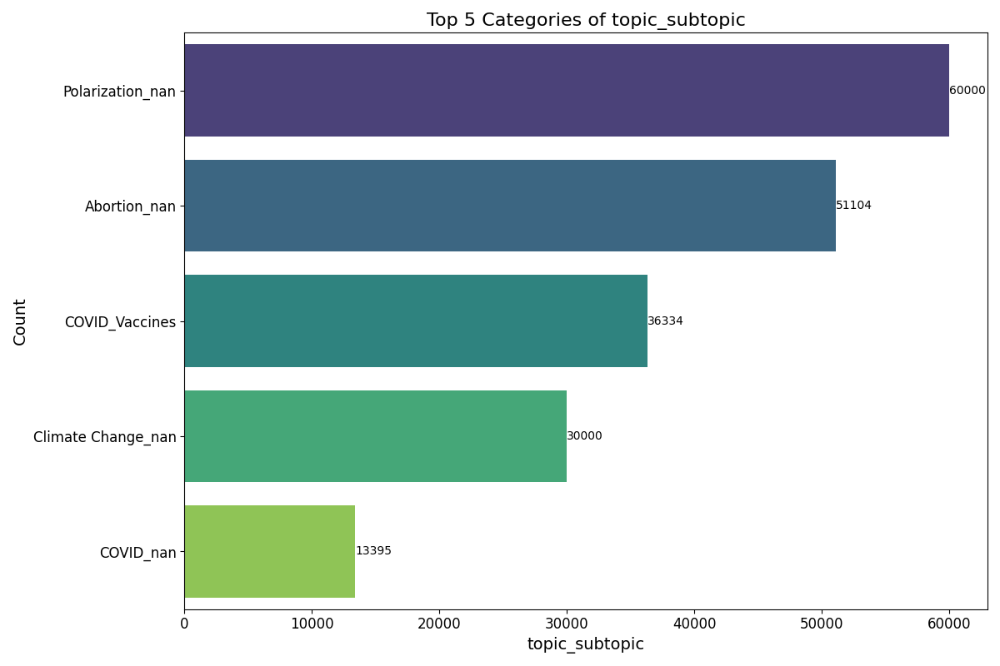

# Beyond Misinformation detection - where does the misinformation/bias come from? 

### Information and bias tracing  - how do LLMs fare? 

# **Comprehensive Dataset for AI-Generated Content and Tracing Research**

## **Abstract**
This project introduces a **comprehensive enriched dataset** designed to bridge the gap between real-world content and AI-generated content, with a focus on tracing information origins, identifying biases, and addressing misinformation. The dataset is enriched with metadata such as misinformation labels, political polarization, sentiment classifications, and demographic indicators. It covers a wide range of topics, including public health (COVID-19), politics, conflict reporting, and social issues, making it an essential resource for training AI models, generating prompts, and conducting comparative analysis.

The practical and ethical significance of this work lies in its ability to:
1. Detect and mitigate biases in AI-generated content.
2. Enhance transparency by tracing how AI models utilize and amplify information from specific sources.
3. Provide a foundation for advancing Responsible AI practices, with real-world applications in public health, political discourse, and media integrity.

This dataset serves as the **artifact** of this project, alongside analytical pipelines and prompt engineering frameworks that enable deeper understanding of AI behavior and its alignment with societal values.

---

## **Overview**
### **Project Goals**
The primary goal of this project is to create a **versatile dataset** and accompanying analytical tools that support the following objectives:
1. **Model Training**: Enable classifiers for misinformation detection, bias analysis, and sentiment prediction.
2. **Prompt Engineering**: Offer structured prompts for generating AI content, with the ability to analyze biases and narratives in AI outputs.
3. **Content Tracing**: Facilitate tracing the reliance of AI-generated content on specific real-world sources and themes, shedding light on the ethical implications of AI decision-making.

By enriching and unifying datasets from diverse sources—ranging from verified news to Reddit discussions—this project provides a robust framework for addressing some of the most pressing issues in AI research, including explainability, accountability, and ethical content generation.

### **Significance**
The dataset is uniquely positioned to address challenges in:
1. **Misinformation**: By labeling and analyzing misinformation in real and AI-generated content, it offers actionable insights for mitigating its spread.
2. **Bias Detection**: It highlights how biases from real-world sources (e.g., politically polarized news, gendered language) influence AI models.
3. **Explainability**: The metadata-rich structure supports explainable AI research, providing transparency into how AI systems process and replicate human-generated content.

---
#### Dataset Overview

The constructed datasets has the following structure: 


[Link to dataset](https://drive.google.com/file/d/18O_03z7Lq9QDOtWSikszl3sji1QFT7WQ/view?usp=sharing) 

# The flow of one of the use cases of the dataset 


# Visualizations of Dataset Statistics

This section provides insights into the dataset through visualizations of key statistics and distributions.

## Polarization Flag Distribution


## Publisher Distribution


## Gender Distribution


## Sentiment Category Distribution


## Source Distribution


## Topic Distribution


## Topic-Subtopic Distribution


## Type of Content Distribution


## **Dataset Description**
The dataset is the centerpiece of this project, meticulously curated and enriched to facilitate a wide range of applications.

### **Core Components**
1. **Title**: Includes news headlines, Reddit post titles, and tweet summaries.
2. **Body**: Contains the full text of news articles, social media posts, or comments.
3. **Source**: Specifies the origin of the content (e.g., Reddit, Twitter, verified news).
4. **Timestamp**: Captures the temporal context, allowing for temporal analysis of trends and narratives.

### **Enrichment Layers**
1. **Misinformation and Polarization**:
   - Labels content as fake, biased, or neutral, with further classifications for political leanings (e.g., left, right, center).
2. **Sentiment Analysis**:
   - Categorizes content into positive, negative, or neutral sentiment, enabling sentiment comparison across topics and sources.
3. **Named Entities**:
   - Extracts key entities (e.g., people, organizations, events) using NLP techniques, making the dataset searchable and analyzable by specific themes.
4. **Demographic Markers**:
   - Adds gender and demographic predictions where applicable to assess biases in AI responses.
5. **Thematic Layers**:
   - Organizes content by high-level topics (e.g., COVID-19, elections) and subtopics (e.g., vaccines, Roe v. Wade).

### **Topics and Subtopics**
This dataset is structured to support analyses across diverse themes:
- **Public Health**: COVID-19, vaccines, and misinformation.
- **Politics**: Elections, political ads, and debates.
- **Conflicts**: Russia-Ukraine war, Israel-Palestine conflict.
- **Social Issues**: Abortion rights, climate change, and hate speech.

---

## **Pipeline Workflow**
The dataset was created and enriched through a multi-step pipeline, fully documented in `notebooks/Datasets_pipeline.ipynb`.

### **1. Data Collection and Integration**
- Sources include over 50 datasets spanning news, social media, and misinformation repositories. Examples:
  - [Fake News Classification](https://www.kaggle.com/datasets/saurabhshahane/fake-news-classification)
  - [COVID-19 Vaccine News on Reddit](https://www.kaggle.com/datasets/xhlulu/covid19-vaccine-news-reddit-discussions)
  - [Russia-Ukraine Conflict Tweets](https://www.kaggle.com/datasets/tariqsays/russiaukraine-conflict-twitter-dataset)

### **2. Data Preprocessing**
- **Unification**: Standardized column names (e.g., titles, bodies) across datasets.
- **Cleaning**: Removed duplicates, irrelevant content, and incomplete data.
- **Normalization**: Applied tokenization, stemming, and text normalization.

### **3. Enrichment**
- **Sentiment Analysis**: Used pre-trained models to classify content sentiment.
- **Named Entity Recognition**: Extracted entities using SpaCy for deeper analysis.
- **Bias Classification**: Labeled content with political polarization and misinformation markers using fine-tuned models.

### **4. Prompt Engineering**
- Designed structured prompts to generate AI content, enabling comparison with real-world data:
  - "Generate a news article with this title: [title]."
  - "Write about [topic] from the perspective of [political leaning]."

### **5. Comparative Analysis**
- **Traceability**:
  - Applied real-world-trained classifiers to AI-generated content to assess alignment with the original sources.
- **Bias Detection**:
  - Analyzed AI outputs for political bias, sentiment imbalance, and reliance on specific narratives.
- **Temporal Analysis**:
  - Studied shifts in AI-generated content over time to identify emerging patterns.

---

## **Project Deliverables**
1. **Dataset Artifact**:
   - The unified and enriched dataset is the core contribution of this project, available as `global_dataset.csv`. It is designed for multiple applications, from training models to exploring content generation.
   
2. **Pipeline Documentation**:
   - The pipeline for data preprocessing, enrichment, and analysis is available in `notebooks/Datasets_pipeline.ipynb`.

3. **Prompting Framework**:
   - Example prompts and generated AI outputs are included for reproducibility and further analysis.

4. **Analytical Insights**:
   - Comparative analyses between real-world and AI-generated content, focusing on bias, misinformation, and traceability.

---

## **Practical and Ethical Importance**
This dataset has far-reaching implications for real-world applications:
1. **Public Health**:
   - Detecting and mitigating misinformation on vaccines and COVID-19-related topics.
2. **Political Accountability**:
   - Identifying biases in AI-generated narratives on elections and political discourse.
3. **Conflict Reporting**:
   - Enhancing transparency in narratives around global conflicts like the Russia-Ukraine war.

The dataset aligns with the principles of Responsible AI, promoting transparency, explainability, and accountability in AI-generated content.

---

## **Future Work**
1. **Expansion**:
   - Incorporate more domains and AI-generated datasets to enhance comprehensiveness.
2. **Explainability**:
   - Develop visualization tools, such as attention maps, to explain AI decision-making processes.
3. **Benchmarking**:
   - Create benchmarks for misinformation detection and bias tracing using the dataset.

---

## **Repository Structure**
1. **Datasets**:
   - Unified dataset: `datasets/global_dataset.csv`
   - Individual datasets: Available in `datasets/`

2. **Notebooks**:
   - Pipeline workflow: `notebooks/Datasets_pipeline.ipynb`

3. **Writeups**:
   - `writeups/Data_source.md`: Documentation of data sources and structure.
   - `writeups/ai_datasets.md`: AI and LLM-related datasets.
   - `writeups/datasets_list.md`: Detailed descriptions of all integrated datasets.

---

## **Usage**
1. Clone the repository:
   ```bash
   git clone https://github.com/Nastiiasaenko/Final-Project---Explainable-AI-.git


