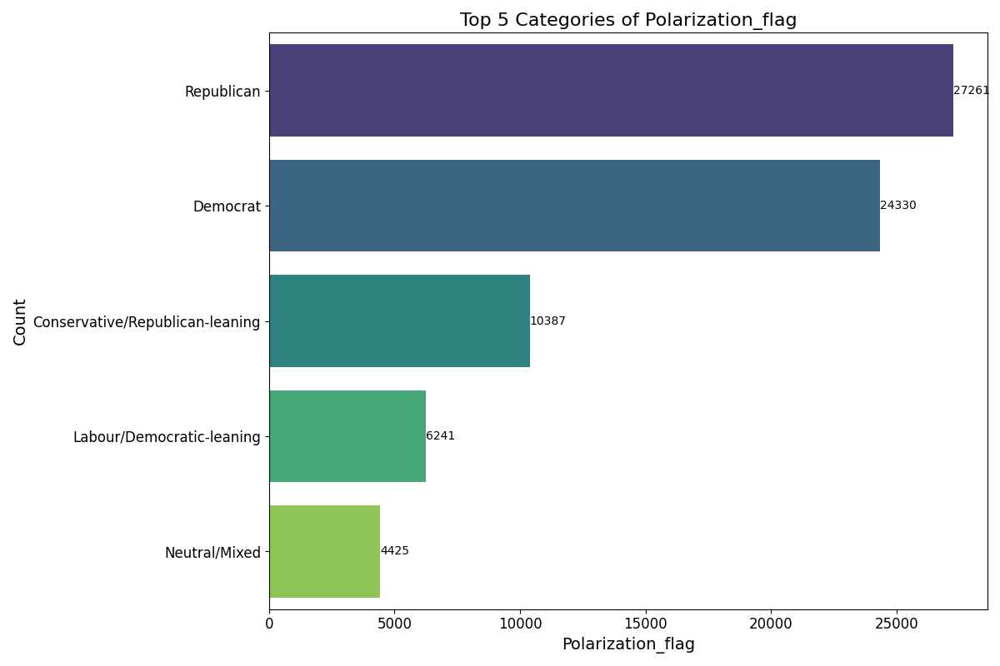
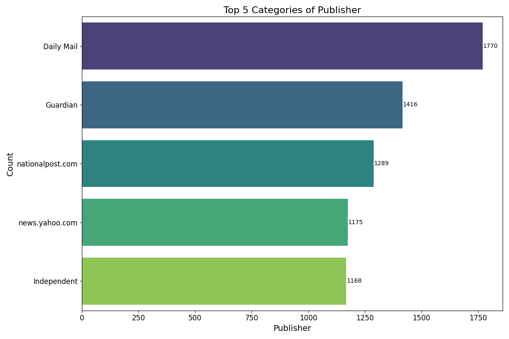
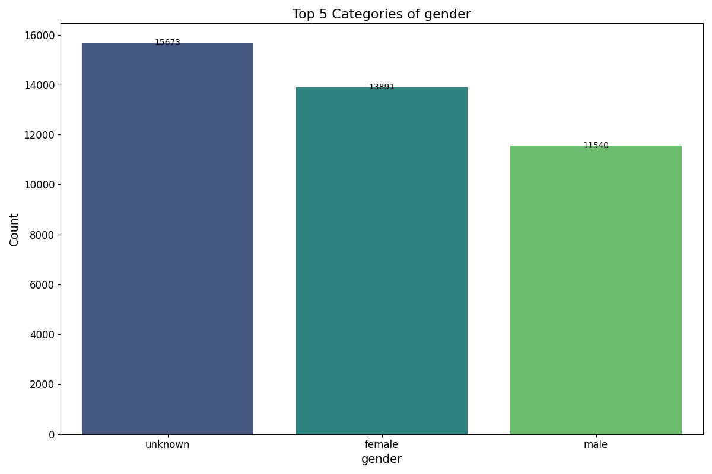
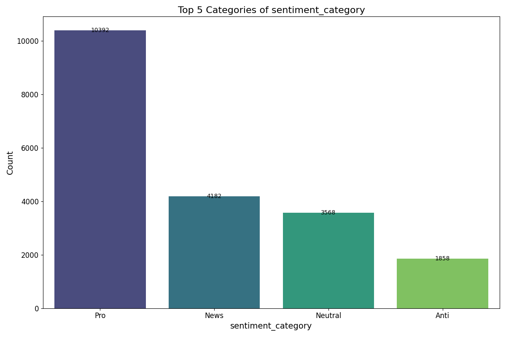
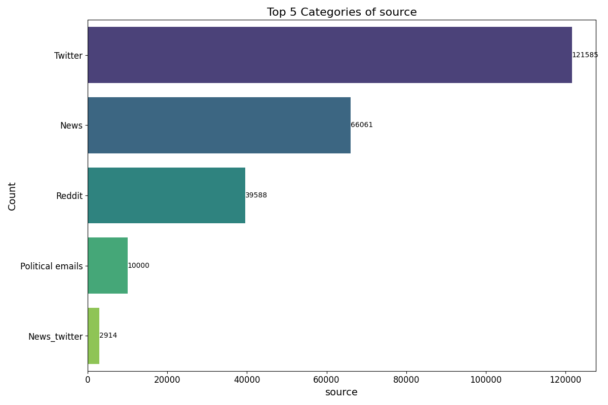
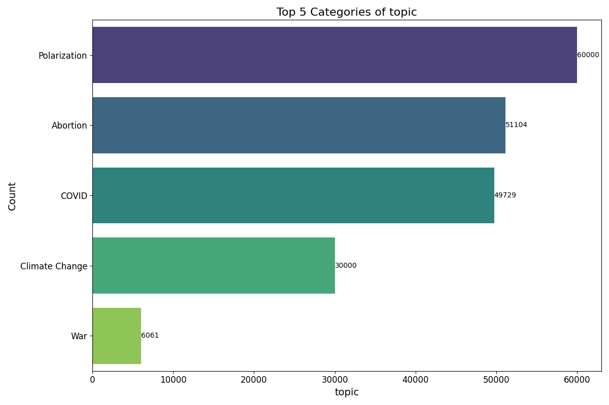
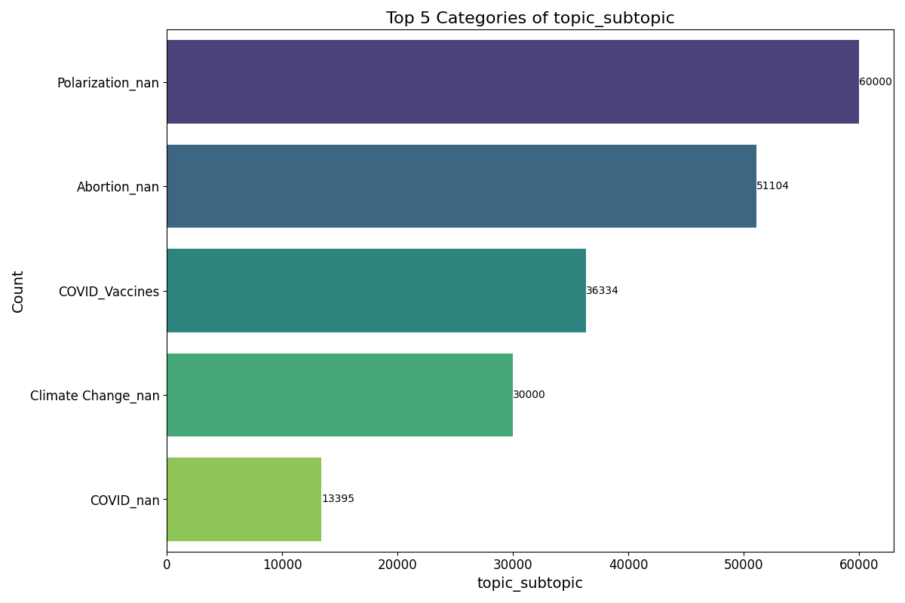
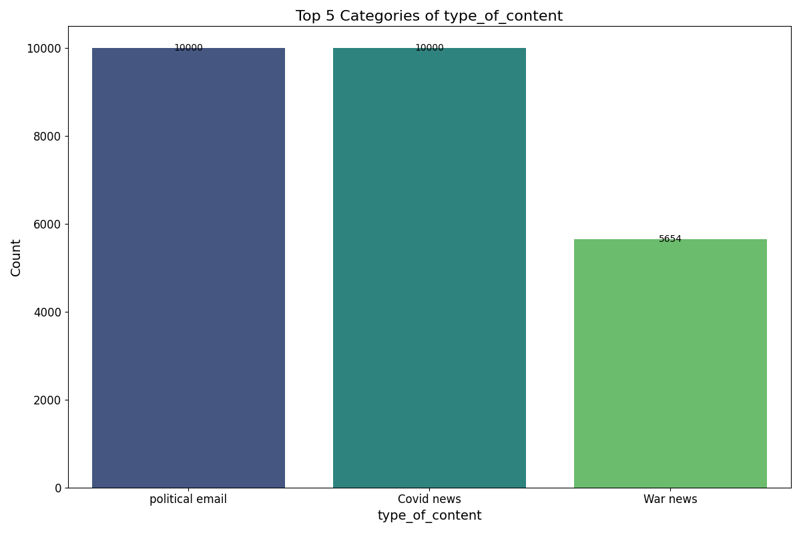

# Visualizations of Dataset Statistics

This section provides insights into the dataset through visualizations of key statistics and distributions.

## Polarization Flag Distribution

## Publisher Distribution

## Gender Distribution

## Sentiment Category Distribution

## Source Distribution

## Topic Distribution

## Topic-Subtopic Distribution

## Type of Content Distribution

